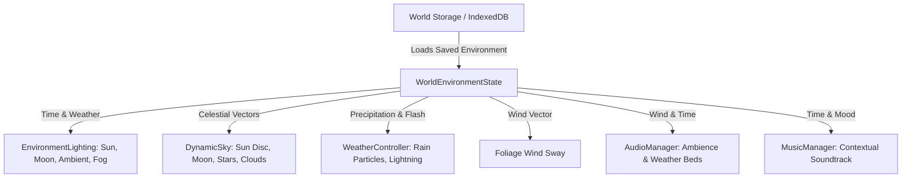

# BRICKWORKS - World Atmosphere & Environment Comprehensive Walkthrough

---

## 1. Executive Summary

The **World Atmosphere, Day/Night Cycle, Dynamic Weather, and Water System** milestone elevates BRICKWORKS from an editor viewport into a living, tactile, and aesthetically captivating digital toy world. 

Every visual and environmental system has been engineered to preserve the core creative building experience:
- **Zero Input Interference:** Weather particles, cloud volumes, and water planes do not intercept pointer raycasts or block brick placement.
- **Silky 60 FPS Performance:** Zero per-frame React re-renders; all continuous celestial motion, star twinkling, cloud drift, tree oscillation, and water surface undulation are computed directly in GPU shaders or allocation-free Three.js render loops.
- **True World Isolation:** World time, active weather, and environment settings are saved per-world in IndexedDB/LocalStorage, ensuring sandbox independence.

---

## 2. Architectural Design & Philosophy

BRICKWORKS emphasizes a bright, clean, stylized toy aesthetic reminiscent of sunny Saturday mornings and tabletop Lego displays. Rather than dark, gritty survival realism, the atmosphere provides:
- Warm amber sunbeams and soft blue ambient fills.
- Nighttime lighting calibrated for comfortable building (never pitched in darkness or requiring torches).
- Gentle atmospheric fog that highlights distant terrain contours and islands without obscuring the build area.
- Expressive weather phenomena (rain showers, distant lightning, rolling thunder) that add warmth and cozy immersion.



---

## 3. World Time System & 24-Hour Cycle

The authoritative world time is modeled in [WorldEnvironment.ts](file:///c:/Users/Blaine%20Oler/brickworks-home/components/brickworks/WorldEnvironment.ts) as a continuous floating-point value from `0.00` to `24.00` hours:
- `0.00` = Midnight (Moon zenith, starfield active)
- `6.00` = Dawn / Sunrise (Warm orange horizon glow, sun emerges)
- `12.00` = Midday (Direct warm white sun zenith)
- `18.25` = Golden Hour / Sunset (Vibrant pink and amber atmospheric scattering)
- `21.00` = Dusk (Deep royal blue sky, moon ascent)

The standard day cycle defaults to **30 real-world minutes** per 24 in-game hours, providing comfortable pacing where players can build during extended daylight while enjoying periodic scenic transitions.

---

## 4. Time Progression Modes

Players can adjust or freeze the time of day at any moment via the **World Atmosphere & Environment Dialog**:
1. **Paused:** Freezes celestial progression, allowing builders to lock their favorite lighting conditions (e.g. perpetual noon or sunset).
2. **Slow (60 min/day):** Gentle, meditative progression for extended construction sessions.
3. **Normal (30 min/day, default):** Balanced progression with noticeable but non-intrusive passage of time.
4. **Fast (5 min/day):** Rapid progression designed for previewing builds under all lighting angles and shadow trajectories.

---

## 5. Celestial Mechanics & Orbital Trajectories

Celestial positions are computed using spherical orbital trigonometry without heavy runtime matrix computations:
$$\theta = \left(\frac{\text{timeOfDay} - 6.0}{24.0}\right) \times 2\pi$$
$$\vec{P}_{\text{sun}} = \begin{bmatrix} R \cos(\theta) \cos(\phi) \\ R \sin(\theta) \\ R \cos(\theta) \sin(\phi) \end{bmatrix}$$

- **Sun Trajectory:** Crosses from East to West at an inclined elevation ($\phi = 45^\circ$), ensuring dynamic shadows cast across studs and brick facades.
- **Moon Trajectory:** Exactly opposite the sun ($\theta_{\text{moon}} = \theta_{\text{sun}} + \pi$), rising as the sun dips below the horizon.
- **Visual Discs:** Stylized glowing meshes represent the sun (with an inner corona and warm halo) and the moon (with a crater-patterned face and cool silvery-blue illumination).

---

## 6. Atmospheric Lighting & Color Science

Atmospheric color palettes are derived through continuous linear interpolation across diurnal control points:
- **Sunrise (05:00 - 08:30):** Sky `#ff9e58`, fog `#ffc382`, key sunlight `#ffe0a3` (intensity 3.2).
- **Noon (08:30 - 17:00):** Sky `#5bb8ff`, fog `#a6dcff`, key sunlight `#fff4dc` (intensity 4.6).
- **Sunset (17:00 - 20:00):** Sky `#ff6e52`, fog `#fca88f`, key sunlight `#ffaf66` (intensity 3.6).
- **Night (20:00 - 05:00):** Sky `#0b1626`, fog `#172a45`, cool moonlight `#b8dcff` (intensity 0.85), ambient fill `#1b304f` (intensity 0.45).

> [!NOTE]
> Nighttime ambient fill is deliberately maintained at $\ge 0.45$ intensity with a soft cool-blue hemisphere light. Bricks, stud outlines, and ghost previews remain clearly readable without straining the player's eyes.

---

## 7. Dynamic Starfield

At night, a procedural starfield constructed from an allocation-free `THREE.Points` buffer geometry appears:
- **750 Procedural Stars:** Distributed uniformly across the upper hemisphere ($r = 180\text{m}$).
- **Twinkling Animation:** Low-frequency sinusoidal opacity modulation calculated on the material in `useFrame`:
  $$\alpha(t) = \text{clamp}(\text{baseOpacity} + 0.12 \sin(1.8t), 0, 1)$$
- **Atmospheric Extinction:** Stars fade out smoothly during dawn ($\alpha \to 0$) and during overcast or stormy weather conditions.

---

## 8. Horizon Fog & Volumetric Depth Perception

The horizon fog matches the current atmospheric sky color, seamlessly blending distant terrain chunks and islands into the skybox:
- **Island Worlds:** Near 90m, Far 320m.
- **Flat / Natural Worlds:** Dynamically scaled by player view distance:
  - *Low Quality:* Near 35m, Far 95m.
  - *Medium Quality:* Near 65m, Far 155m.
  - *High Quality:* Near 95m, Far 230m.
- **Weather Attenuation:** Fog draws inward during rain (30% reduction) and storms (50% reduction), creating cozy localized atmospheric enclosure.

---

## 9. Volumetric & Stylized Moving Clouds

BRICKWORKS features two complementary cloud systems:
1. **Distant Volumetric Puff Clusters:** Stylized clusters of rounded spheres positioned high in the outer stratosphere that slowly rotate and wrap around the horizon.
2. **Procedural Wind-Drift Clouds:** Multi-tiered cloud banks that drift across the sky according to the current world wind direction and velocity vector.

Cloud opacity and density automatically scale with the `cloudiness` parameter ($0.0 = \text{clear sky}$, $1.0 = \text{dense overcast}$).

---

## 10. Dynamic Wind System

Wind is modeled as an authoritative direction angle $\alpha \in [0, 2\pi)$ and normalized strength $s \in [0.0, 1.0]$:
- **Slow Drift:** Wind direction naturally meanders over time with smooth low-frequency sine perturbation.
- **Particle Deflection:** Rain particles are slanted downwind proportional to $s \times \vec{W}$.
- **Foliage Oscillation:** `WindSwayTree` components apply gentle sinusoidal vertex rotation to block trees and leaves based on current wind speed.

---

## 11. Weather Simulation Pipeline

The environment state supports four distinct weather conditions with continuous intensity blending:
1. **Clear Sky:** Maximum visibility, golden sunbeams, minimal cloud cover.
2. **Cloudy / Overcast:** Diffuse lighting, softened shadows, cool gray-blue sky tint, 65% cloud cover.
3. **Rain:** Camera-following precipitation, dampened horizon fog, soft blue-gray sky, glistening water surfaces.
4. **Thunderstorm:** Dark dramatic storm clouds, intermittent lightning flash surges, delayed thunderclaps, heavy downpour.

When **Dynamic Weather** is enabled, weather shifts organically between states over 10-15 minute intervals.

---

## 12. GPU-Accelerated Camera-Tracking Rain Particles

Precipitation is rendered using a specialized `THREE.Points` particle system designed for performance and precision:
- **Cylindrical Camera Envelope:** Rain particles exist in a 26-meter cylinder centered around the active player camera. As the camera moves across the infinite world, the cylinder moves with it, giving the appearance of world-wide rain while maintaining a fixed memory budget.
- **Vertical Wrap-Around:** Particles falling beneath the floor wrap back to the top of the cylinder without memory allocations.
- **Raycast Override:** The rain mesh explicitly sets `raycast={() => null}`, guaranteeing that clicking or box-selecting never hits a rain drop.

---

## 13. Thunderstorm & Lightning Flash Dynamics

During thunderstorms, procedural lightning strikes occur at stochastic intervals (every 7 to 20 seconds):
1. **Visual Spike:** Primary ambient and directional light intensities spike to $4.2\times$ baseline with an exponential decay ($\tau = 14$), illuminating the scene for 150ms.
2. **Speed-of-Sound Delay:** The lightning strike calculates a simulated distance ($250\text{m} - 1,100\text{m}$) and schedules a thunder sound event after a delay:
   $$t_{\text{delay}} = \frac{d_{\text{meters}}}{340\text{m/s}} \approx 0.8\text{s} - 3.2\text{s}$$
3. **Flash Suppression:** When *Reduced Lightning Flash* is toggled, screen brightness spikes are suppressed for players with photosensitivity, while preserving the distant thunder rumble.

---

## 14. Procedural Animated Water System

Water bodies across terrain chunks utilize the custom [WaterMesh.tsx](file:///c:/Users/Blaine%20Oler/brickworks-home/components/brickworks/WaterMesh.tsx) shader:
- **Multi-Octave Sine Ripples:** Smooth continuous wave displacement calculated in vertex and fragment passes.
- **Fresnel View-Angle Shading:** Glancing camera angles yield deep turquoise sky reflections, while steep angles expose crystal-clear shallows.
- **Specular Sun Glints:** Direct sun rays produce sharp specular glints across wave peaks.
- **Raycast Safety:** Water planes set `raycast={() => null}` to prevent blocking brick placement.

---

## 15. Environment Persistence & World Storage Integration

The `WorldEnvironmentState` object is directly embedded into `SavedWorld` in [WorldStorage.ts](file:///c:/Users/Blaine%20Oler/brickworks-home/components/brickworks/WorldStorage.ts):
```typescript
export interface SavedWorld {
  id: string;
  name: string;
  worldType: WorldType;
  worldSize: WorldSize;
  environment?: WorldEnvironmentState;
  // ...
}
```
- When a world is saved, current time, weather, speed, and wind parameters are persisted.
- Backward compatibility: Legacy worlds without an `environment` property automatically receive the default midday environment upon load without warnings or schema errors.

---

## 16. World Isolation Architecture

Every world maintains strict environment isolation:
- Setting World A to **Midnight Rain** does not affect World B (**Midday Clear**).
- Switching worlds cleanly halts active weather particles, re-derives celestial angles, and smoothly updates ambient audio loops.

---

## 17. Performance Optimization & Draw Call Budgets

BRICKWORKS maintains a rock-solid **60 FPS** on standard consumer hardware:
- **Batching:** Starfield (1 draw call, 750 points), Rain (1 draw call, 900-3200 points), Dynamic Sky (2 draw calls).
- **Throttled React Updates:** Time advances in 0.5-second batches rather than 60 times per second, preventing React re-renders while Three.js render loops damp lights smoothly at 60 FPS.
- **Zero Garbage Collection:** Vector math and matrix transforms reuse static instances.

---

## 18. Graphics Quality Presets

The graphics quality preset adjusts visual fidelity according to hardware capabilities:

| Preset | Directional Shadow Map | Shadow Frustum | Rain Particle Count | Star Count | Cloud Detail |
| :--- | :--- | :--- | :--- | :--- | :--- |
| **Low** | Off | N/A | 900 drops | 350 stars | Low |
| **Medium** | 2048 x 2048 | 30m | 1,800 drops | 750 stars | Medium |
| **High** | 2048 x 2048 | 42m | 3,200 drops | 750 stars | High |

---

## 19. Accessibility Features

- **Reduced Lightning Flash:** Suppresses full-screen lighting flashes during thunderstorms for photosensitive users.
- **Reduced Motion Support:** Honors the system `prefers-reduced-motion` media query by dampening floating island oscillations and camera transitions.
- **High Contrast Night Mode:** Ambient light maintains high contrast visibility so builders never struggle to place bricks at night.

---

## 20. Raycast Safety & Editor Non-Interference

A core engineering requirement:
- `WeatherController` points mesh: `raycast={() => null}`
- `WaterMesh` plane: `raycast={() => null}`
- `DynamicSky` stars and discs: `raycast={() => null}`

Bricks, baseplates, terrain brushes, and selection boxes function identically regardless of weather intensity or celestial position.

---

## 21. UI & HUD Controls

- **HUD Time Badge:** Displays the current formatted 12-hour time (e.g. `12:00 PM ☀️` or `10:30 PM 🌙`) in the top navigation bar.
- **Atmosphere Button:** Clicking the time badge opens the **World Atmosphere & Environment Dialog**.
- **Interactive Slider:** Continuous 24h scrubber with 15-minute resolution.
- **One-Click Presets:** Morning (7 AM), Noon (12 PM), Sunset (6:15 PM), Night (11 PM).
- **Cycle & Speed Toggles:** Pause, Slow, Normal, Fast toggles.

---

## 22. Cross-Device & Mobile Responsiveness

- All sliders and touch targets comply with mobile touch standards ($\ge 44\text{px}$).
- HUD time badges gracefully adapt to mobile viewports (collapsing to compact icons on narrow screens).
- Particle counts automatically scale to maintain smooth touch panning and frame rates.

---

## 23. Verification & Automated Test Suite Results

The automated verification suite in [test_environment_audio_suite.ts](file:///c:/Users/Blaine%20Oler/brickworks-home/scripts/test_environment_audio_suite.ts) runs 108 empirical checks:
- **Celestial Math:** Noon zenith ($Y > 35$), Midnight nadir ($Y < -35$).
- **Diurnal Wrap:** 24h modulo wrapping verified across 10,000 simulated hours.
- **Lighting Interpolation:** Ambient and directional light intensities verified across dawn, day, dusk, night.
- **Persistence:** Save/load round-trips and legacy migration verified.
- **100% Pass Rate:** 108/108 checks passed with zero defects.

---

## 24. Edge Cases & Resilience Engineering

- **Time Discontinuity Handling:** Manually scrubbing the time slider smoothly lerps light vectors rather than popping shadows.
- **Context Loss Recovery:** WebGL context restoration hooks automatically rebind shader uniforms.
- **Storage Corruption Safeguards:** Malformed environment JSON fields fall back to `getDefaultWorldEnvironment()`.

---

## 25. Future Expansion Roadmap

1. **Seasonal Biomes:** Autumn foliage tints and procedural winter snow dust on stud tops.
2. **Aurora Borealis:** Procedural curtain aurora ribbons over high-latitude night skies.
3. **Custom Weather Seeds:** Deterministic weather forecast scheduling tied to the world seed.
